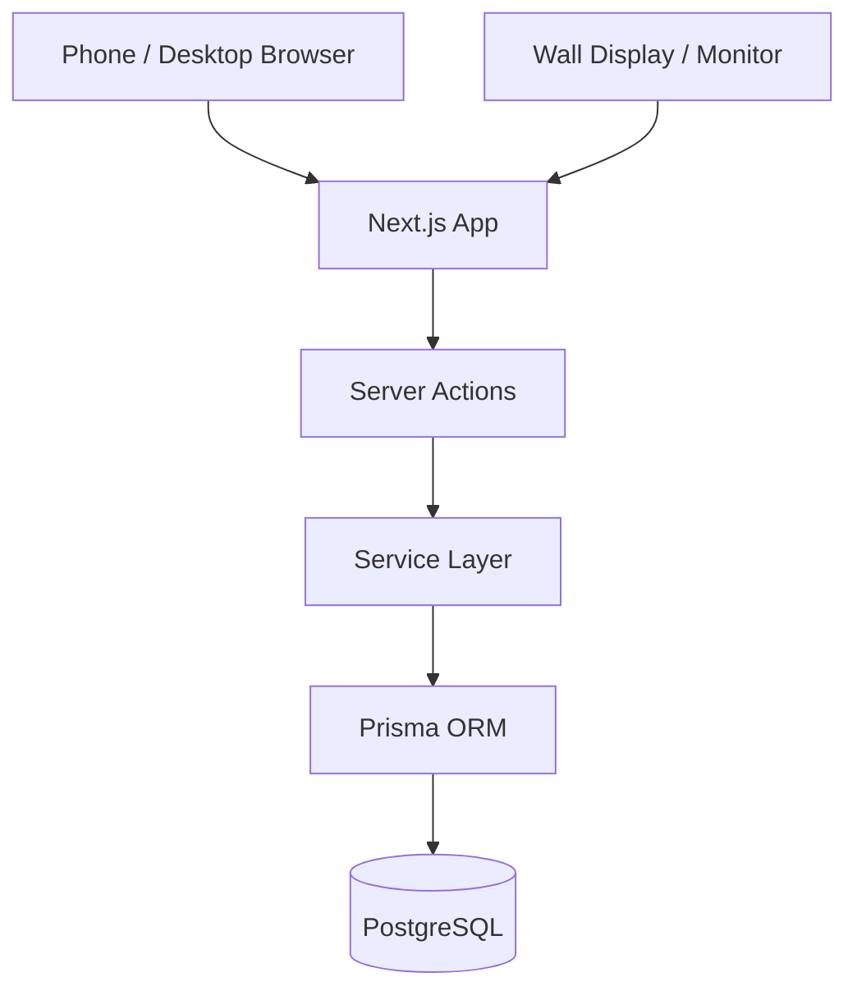
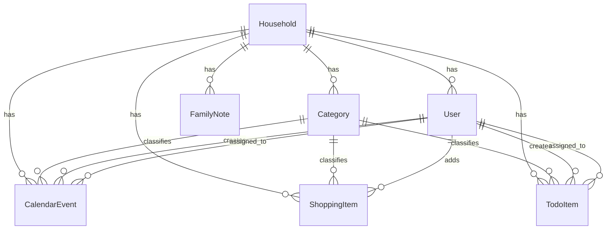

# Family Hub

Family Hub is a self-hostable family organization app designed for a shared household workflow.

It is intended to run as:

- a **normal web app** on phones, tablets, and desktop
- a **wall dashboard** on a Raspberry Pi-powered home display

The goal of the project is to provide a simple but upgradeable family dashboard that helps a household stay aligned around the things that matter now.

---

# Project Goals

Family Hub is built around a few practical household use cases:

- shared calendar
- shared shopping list
- shared todo list
- shared family notes/reminders
- household dashboard
- wall-display mode for a monitor or TV

The app is intentionally designed to start simple and evolve gradually over time.

---

# Product Concept

Family Hub supports two main usage modes:

## 1) App Mode
Used on phone / tablet / laptop / desktop for:

- adding and editing shopping items
- managing todos
- reviewing events
- updating notes
- household management

This is the **interactive management mode**.

## 2) Wall Mode
Used on a dedicated screen (for example a Raspberry Pi connected to a monitor) for:

- showing today’s date/time
- displaying upcoming events
- showing open todos
- previewing shopping items
- displaying one pinned family note

This is the **read-only household display mode**.

---

# Core Product Modules

The MVP is organized into the following modules:

## 1. Dashboard
The family “what matters now?” page.

Shows:
- today’s events
- upcoming events
- open todos
- overdue todos
- active shopping items
- pinned family note

## 2. Calendar
Used for household events.

Examples:
- school pickup
- appointments
- family visits
- reminders tied to a date/time

## 3. Shopping List
Used for fast household item capture.

Examples:
- milk
- detergent
- bananas
- dishwasher tabs

This flow should be optimized for **very fast entry**.

## 4. Todo List
Used for household tasks.

Examples:
- take recycling out
- pay school form
- clean kitchen
- call plumber

Todos are different from events:
- **events** happen at a time/date
- **todos** are tasks to complete

## 5. Family Notes
Used for short household communication.

Examples:
- “Remember swimming bags tomorrow”
- “Grandma visiting on Sunday”
- “Don’t forget the picnic blanket”

One note can be pinned to appear on the dashboard and wall mode.

## 6. Wall View
A simplified large-font dashboard designed for distance readability.

---

# Architecture Overview

This project intentionally uses a **monolithic full-stack architecture** for v1.

That means:

- **frontend and backend live in the same Next.js app**
- **business logic is organized in service files**
- **database is PostgreSQL**
- **Prisma is used as the ORM**
- **Docker Compose is used for deployment**

This is a deliberate choice to keep the system:

- simple to build
- easy to deploy
- easy to maintain
- upgradeable later

## Architecture Diagram



---

# Why This Architecture?

Instead of splitting the app into separate frontend and backend services immediately, Family Hub starts with:

- **Next.js for UI**
- **Next.js server components / server actions for backend logic**
- **Prisma for data access**
- **PostgreSQL for persistence**

This gives a strong balance between:

- development speed
- maintainability
- low deployment complexity
- future extensibility

For a household app running on a Raspberry Pi, this is a much better tradeoff than overengineering too early.

---

# Tech Stack

## Frontend
- Next.js (App Router)
- React
- TypeScript
- Tailwind CSS

## Backend
- Next.js server actions / server-side logic
- TypeScript

## Database
- PostgreSQL
- Prisma ORM

## Deployment
- Docker Compose

## Target Runtime
- Raspberry Pi 4
- also works in a normal local dev environment

---

# Current MVP Scope

The current MVP includes these main entities:

- Household
- User
- Category
- CalendarEvent
- ShoppingItem
- TodoItem
- FamilyNote

The app is built to support a **single household-centric model**, where all important records belong to a household.

---

# Data Model Overview

## Household
Represents the family / shared home space.

Contains:
- users
- categories
- notes
- events
- shopping items
- todos

## User
Represents a family member.

Supports:
- role
- optional login credentials
- created items / todos / events
- assigned items where applicable

## Category
Optional classification layer for:
- calendar
- shopping
- todos

Examples:
- Groceries
- Chores
- Family
- School

## CalendarEvent
Represents something happening at a date/time.

Examples:
- school pickup
- doctor appointment
- grandma visit

## ShoppingItem
Represents something to buy.

Examples:
- milk
- bananas
- laundry detergent

## TodoItem
Represents a task to complete.

Examples:
- take bins out
- pay school form
- call insurance

## FamilyNote
Represents a shared household note or reminder.

Examples:
- “Bring picnic blanket”
- “Swimming bags tomorrow”


---

## Data Model



---

# Routing Structure

The app currently uses these main routes:

- `/login`
- `/dashboard`
- `/calendar`
- `/shopping`
- `/todos`
- `/settings`
- `/wall`

## Route Intent

### `/login`
Simple household user login page.

### `/dashboard`
Main family overview page.

### `/calendar`
Calendar event list / calendar management area.

### `/shopping`
Shared shopping list page.

### `/todos`
Shared household todo page.

### `/settings`
Household configuration / categories / user overview.

### `/wall`
Read-only wall display mode.

---

# Project Structure

```txt
family-hub/
  app/
    login/
    dashboard/
    calendar/
    shopping/
    todos/
    settings/
    wall/
  components/
    app-shell.tsx
  lib/
    db.ts
    auth.ts
    session.ts
    services/
      dashboard-service.ts
  prisma/
    schema.prisma
    seed.ts
  docker-compose.yml
  middleware.ts
  README.md
  LICENSE
```

---

# License

This project is licensed under the MIT License. See the [LICENSE](./LICENSE) file for details.