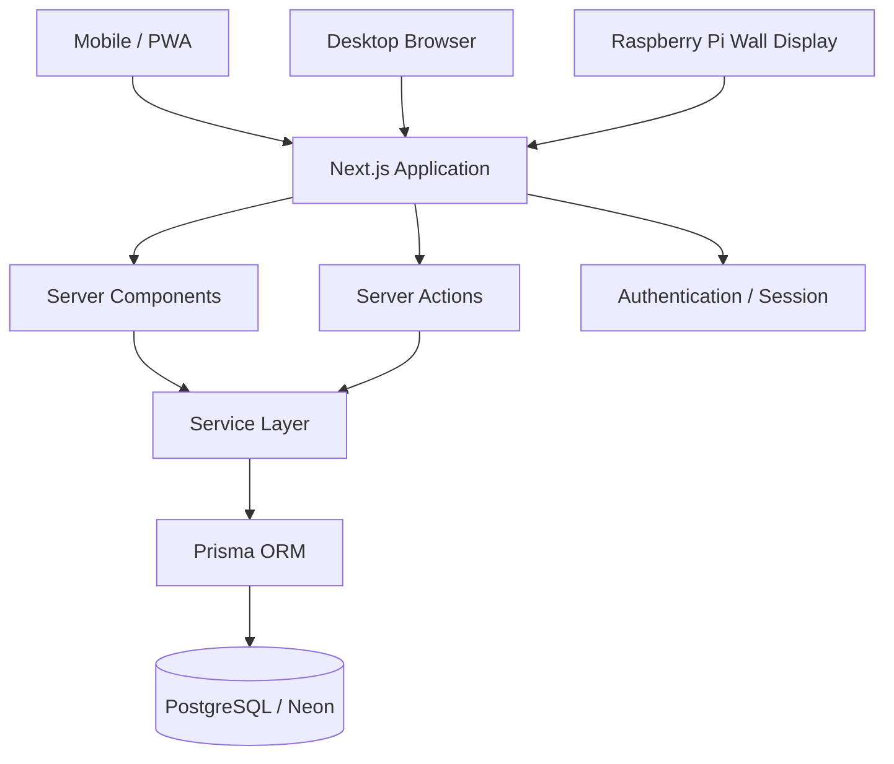
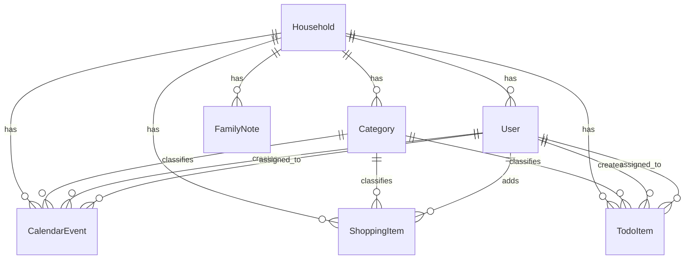

# Family Hub

Family Hub is a self-hostable, mobile-friendly family organization app designed around a shared household workflow.

It provides one central place for a family to manage:

- shared calendar events
- shopping lists
- household todos
- family notes and reminders
- a daily household dashboard
- a dedicated wall-display experience

Family Hub can be used as a normal web app on phones, tablets, and desktops, installed as a Progressive Web App (PWA), or displayed permanently on a Raspberry Pi-powered household screen.

---

# Project Goals

Family Hub is built around a simple idea:

> Give the whole family one shared place to see what matters now.

The project focuses on practical household use cases:

- shared calendar
- shared shopping list
- shared todo list
- shared family notes/reminders
- household dashboard
- family member assignments
- mobile access
- wall-display mode
- lightweight touch interaction

The application intentionally starts with a focused feature set while keeping the architecture flexible enough to evolve over time.

---

# Product Concept

Family Hub supports two primary usage modes.

## 1. App Mode

The normal application is designed for phones, tablets, laptops, and desktops.

It is the main interactive management interface for:

- creating and editing calendar events
- managing shopping items
- managing todos
- reviewing household activity
- updating family notes
- assigning events and tasks to family members
- configuring household categories and settings

The interface is designed mobile-first and adapts to larger screens.

## 2. Wall Mode

Wall Mode is designed for a dedicated household display, for example a Raspberry Pi connected to a wall-mounted monitor.

It provides an at-a-glance family overview with large, distance-readable UI.

Wall Mode supports:

- current date and time
- day, week, and month calendar views
- swipe navigation between dates
- upcoming and recent events
- open todos
- recently completed todos
- completing and reopening todos
- active shopping items
- completing shopping items
- pinned family notes
- family member avatars
- light and dark themes

Wall Mode is primarily optimized for passive household information while still supporting a small set of convenient touch interactions.

---

# Core Product Modules

## Dashboard

The Dashboard answers the question:

> What matters to our family right now?

It shows:

- today's events
- overdue todos
- open todos
- active shopping items
- pinned family note
- recently completed todos
- recent past events

The dashboard uses compact cards and responsive layouts so the most relevant household information remains easy to scan.

---

## Calendar

The shared calendar is used for household events such as:

- school activities
- appointments
- family visits
- birthdays
- pickups
- reminders tied to a date and time

The calendar supports:

- day view
- week view
- month view
- creating events
- editing events
- deleting events
- timed events
- all-day events
- event categories
- family member assignment
- responsive mobile event entry

Timed events require a start and end time.

When an event is marked as an **all-day event**, the time fields are disabled and the event automatically covers the selected calendar day.

---

## Shopping List

The Shopping module is designed for fast household item capture.

Examples:

- milk
- detergent
- bananas
- dishwasher tabs

Shopping items can be:

- quickly added
- categorized
- given quantities or notes
- marked as completed
- reviewed after completion

The workflow is intentionally optimized for quick use on a phone.

---

## Todo List

Todos represent household tasks rather than scheduled events.

Examples:

- take recycling out
- pay school form
- clean kitchen
- call plumber

Todos support:

- priorities
- due dates
- categories
- family member assignment
- open/completed states
- overdue detection
- completion and reopening

The distinction is intentionally simple:

- **events** happen at a particular date/time
- **todos** represent something that needs to be completed

---

## Family Notes

Family Notes provide lightweight household communication.

Examples:

- "Remember swimming bags tomorrow"
- "Grandma is visiting on Sunday"
- "Don't forget the picnic blanket"

A note can be pinned so that important information appears prominently on the Dashboard and Wall Mode.

---

# Mobile-First Design

Family Hub is designed to work comfortably on phones as well as larger household displays.

The responsive UI includes:

- mobile bottom navigation
- touch-friendly controls
- responsive forms
- mobile-friendly date and time inputs
- stacked layouts on narrow screens
- larger multi-column layouts on desktop
- responsive calendar views

The goal is to make common household actions possible with only a few taps.

---

# Progressive Web App

Family Hub can be installed as a Progressive Web App (PWA) on supported devices.

This allows the application to behave more like a native app:

- launch from the home screen
- dedicated Family Hub app icon
- standalone app experience
- convenient access without opening the browser manually

The service worker intentionally avoids caching authentication-sensitive and dynamic application pages aggressively.

This keeps the PWA behavior predictable while the application remains heavily server-driven.

---

# Light and Dark Themes

Family Hub supports both:

- light mode
- dark mode

Theme preference is shared across the application, including Wall Mode.

The theme can be changed directly from the application header or wall display.

---

# Authentication and Household Isolation

Family Hub uses household-scoped authentication.

Authentication includes:

- email/password login
- securely hashed passwords
- signed HTTP-only session cookies
- protected application routes
- `ADMIN` and `MEMBER` roles

Authenticated sessions contain the user and household identity required by server-side operations.

Application data is scoped to the authenticated household so users only operate on records belonging to their household.

---

# Architecture Overview

Family Hub intentionally uses a **modular monolithic full-stack architecture**.

The frontend and backend live in the same Next.js application.

The main architectural layers are:

```text
UI / Pages / Components
        │
        ▼
Next.js Server Components
        │
        ▼
Server Actions
        │
        ▼
Service Layer
        │
        ▼
Prisma ORM
        │
        ▼
PostgreSQL
```

This architecture keeps the project simple to develop and deploy while maintaining clear boundaries between presentation, application logic, and persistence.

## Architecture Diagram


```mermaid
flowchart TD
    M[Mobile / PWA] --> N[Next.js Application]
    D[Desktop Browser] --> N
    W[Raspberry Pi Wall Display] --> N

    N --> SC[Server Components]
    N --> SA[Server Actions]

    SC --> S[Service Layer]
    SA --> S

    S --> P[Prisma ORM]
    P --> DB[(PostgreSQL / Neon)]

    N --> A[Authentication / Session]
```

---

# Why This Architecture?

Family Hub deliberately avoids splitting the system into separate frontend and backend services at this stage.

Instead, it uses:

- Next.js for the UI
- React Server Components for server-rendered application views
- Server Actions for mutations
- service files for reusable business/data-access logic
- Prisma for database access
- PostgreSQL for persistence

This provides a strong balance between:

- development speed
- maintainability
- type safety
- low deployment complexity
- testability
- future extensibility

For a household application and portfolio project, this provides useful architectural structure without introducing unnecessary distributed-system complexity.

---

# Tech Stack

## Frontend

- Next.js (App Router)
- React
- TypeScript
- Tailwind CSS
- Lucide icons
- responsive mobile-first UI
- Progressive Web App (PWA)
- light/dark theme support

## Backend

- Next.js Server Components
- Next.js Server Actions
- TypeScript
- Zod validation
- service-layer architecture

## Authentication

- email/password authentication
- password hashing
- signed HTTP-only session cookies
- household-scoped authorization

## Database

- PostgreSQL
- Prisma ORM
- Neon PostgreSQL for the hosted environment

## Hosting

Current hosted setup:

- **Vercel** — Next.js application
- **Neon** — managed PostgreSQL database

The project can also use local PostgreSQL/Docker for development and self-hosted scenarios.

## Target Clients

- mobile phones
- tablets
- desktop browsers
- installed PWA
- Raspberry Pi-powered wall display

---

# Data Model

The main domain entities are:

- `Household`
- `User`
- `Category`
- `CalendarEvent`
- `ShoppingItem`
- `TodoItem`
- `FamilyNote`

All household-owned records are associated with a household.

## Household

Represents the shared family/home space.

A household contains:

- users
- categories
- calendar events
- shopping items
- todos
- family notes

## User

Represents a family member.

Users can:

- authenticate
- have an `ADMIN` or `MEMBER` role
- create events and todos
- be assigned to events and todos
- add shopping items
- have a display color/avatar

## Category

Provides optional classification for:

- calendar events
- shopping items
- todos

Examples:

- Groceries
- Chores
- Family
- School

## CalendarEvent

Represents something happening on a particular date.

An event can contain:

- title
- description
- start/end date and time
- all-day status
- category
- assigned family member
- creator

## ShoppingItem

Represents something the household needs to buy.

An item can contain:

- name
- quantity
- notes
- category
- status
- creator
- completion information

## TodoItem

Represents a household task.

A todo can contain:

- title
- notes
- priority
- due date
- status
- category
- assigned family member
- creator
- completion information

## FamilyNote

Represents a short shared household message or reminder.

Notes can be pinned so that important information appears prominently throughout the application.

---

# Data Model Diagram


```mermaid
erDiagram
    Household ||--o{ User : has
    Household ||--o{ Category : has
    Household ||--o{ CalendarEvent : has
    Household ||--o{ ShoppingItem : has
    Household ||--o{ TodoItem : has
    Household ||--o{ FamilyNote : has

    Category ||--o{ CalendarEvent : classifies
    Category ||--o{ ShoppingItem : classifies
    Category ||--o{ TodoItem : classifies

    User ||--o{ CalendarEvent : creates
    User ||--o{ CalendarEvent : assigned_to
    User ||--o{ ShoppingItem : adds
    User ||--o{ TodoItem : creates
    User ||--o{ TodoItem : assigned_to
```

---

# Routing Structure

Family Hub currently uses the following main routes:

| Route | Purpose |
| --- | --- |
| `/` | Public Family Hub landing page |
| `/login` | Household member login |
| `/dashboard` | Household overview |
| `/calendar` | Calendar management |
| `/shopping` | Shared shopping list |
| `/todos` | Shared household todos |
| `/settings` | Household configuration |
| `/wall` | Dedicated wall-display experience |

Authenticated application pages are grouped internally using a Next.js `(app)` route group.

The route group does not change the public URLs.

---

# Project Structure

A simplified view of the project structure:

```text
family-hub/
├── app/
│   ├── (app)/
│   │   ├── layout.tsx
│   │   ├── dashboard/
│   │   ├── calendar/
│   │   ├── shopping/
│   │   ├── todos/
│   │   └── settings/
│   │
│   ├── login/
│   ├── wall/
│   │   └── components/
│   │
│   ├── layout.tsx
│   ├── page.tsx
│   └── globals.css
│
├── components/
│   ├── app-shell.tsx
│   ├── mobile-nav.tsx
│   ├── page-header.tsx
│   ├── section-card.tsx
│   ├── family-avatar.tsx
│   └── theme-toggle-icon.tsx
│
├── lib/
│   ├── db.ts
│   ├── auth.ts
│   ├── session.ts
│   ├── theme.ts
│   ├── date.ts
│   ├── ui.ts
│   └── services/
│       ├── dashboard-service.ts
│       ├── family-service.ts
│       └── wall-service.ts
│
├── prisma/
│   ├── schema.prisma
│   └── seed.ts
│
├── public/
│   ├── icons/
│   └── sw.js
│
├── middleware.ts
├── README.md
└── LICENSE
```

The exact internal structure may evolve as features are added, while the overall architectural boundaries remain the same.

---

# Local Development

## Prerequisites

Install:

- Node.js
- npm
- PostgreSQL or Docker
- Git

Clone the repository and install dependencies:

```bash
git clone <repository-url>
cd family-hub
npm install
```

---

# Environment Variables

Create a local `.env` file.

At minimum, Family Hub requires:

```env
DATABASE_URL="postgresql://..."
AUTH_SECRET="..."
```

`DATABASE_URL` points to the PostgreSQL database used by Prisma.

`AUTH_SECRET` is used to securely sign application sessions.

Do not commit real secrets to the repository.

---

# Database Setup

After configuring `DATABASE_URL`, generate the Prisma client:

```bash
npx prisma generate
```

Apply the database migrations:

```bash
npx prisma migrate dev
```

For production environments:

```bash
npx prisma migrate deploy
```

If you want to populate the development database with initial household data:

```bash
npx prisma db seed
```

---

# Running the Application

Start the Next.js development server:

```bash
npm run dev
```

Then open:

```text
http://localhost:3000
```

The normal application can be accessed through the browser, while Wall Mode is available at:

```text
http://localhost:3000/wall
```

---

# Wall Display Setup

The `/wall` route is intended for a dedicated household display.

A typical hardware setup can consist of:

```text
Raspberry Pi
    │
    ├── HDMI ──────► Display
    │
    └── USB ───────► Touch input (when supported)
```

The Raspberry Pi only needs to run a browser in kiosk/full-screen mode and open the hosted Family Hub wall URL.

The application itself can remain hosted remotely on Vercel with the database on Neon.

This means the Raspberry Pi does not need to host the Next.js application or PostgreSQL database unless a fully self-hosted configuration is desired.

---

# Deployment

## Vercel

The Next.js application can be deployed directly to Vercel.

Configure the required environment variables in the Vercel project:

```text
DATABASE_URL
AUTH_SECRET
```

Production database migrations should be applied using:

```bash
npx prisma migrate deploy
```

## Neon

Neon provides the hosted PostgreSQL database used by the deployed application.

The Neon connection string is configured through `DATABASE_URL`.

---

# Security Considerations

Family Hub follows several basic security principles:

- passwords are stored as hashes rather than plaintext
- sessions use HTTP-only cookies
- production session cookies are secure
- protected routes require authentication
- database queries are scoped to the authenticated household
- server-side validation is performed for mutations
- secrets are stored in environment variables

Because Family Hub manages private household information, security and household data isolation remain important as the application evolves.

---

# Design Principles

Several principles guide development of Family Hub.

## Mobile First

Household actions should be easy to perform from a phone.

## Wall Friendly

Important information should remain readable from a distance.

## Fast Interaction

Common actions such as adding shopping items or completing todos should require very few steps.

## Household Scoped

All important application data belongs to a household.

## Server Driven

Server Components and Server Actions are preferred where appropriate, with client components used for interactions that genuinely require browser state.

## Progressive Enhancement

Features such as PWA installation and touch interaction improve the experience without making the core application dependent on them.

## Avoid Overengineering

The architecture should remain understandable and maintainable as the project grows.

---

# Current Status

Family Hub is under active development.

Core functionality currently includes:

- authentication
- household-scoped data
- responsive application shell
- mobile navigation
- dashboard
- day/week/month calendar
- timed and all-day events
- shopping management
- todo management
- family notes
- categories
- family member assignment
- light/dark themes
- interactive wall mode
- PWA support
- Vercel deployment
- Neon PostgreSQL persistence

---

# Roadmap

Potential future improvements include:

- richer household member management
- profile/avatar management
- recurring calendar events
- recurring household tasks
- notifications and reminders
- improved offline/PWA capabilities
- calendar integrations
- better wall-display customization
- additional household widgets
- accessibility improvements
- automated testing coverage
- observability and health monitoring
- optional cloud/self-hosted deployment improvements

The roadmap is intentionally flexible. New functionality should continue to serve practical household workflows rather than adding complexity for its own sake.

---

# License

This project is licensed under the MIT License.

See [LICENSE](./LICENSE) for details.